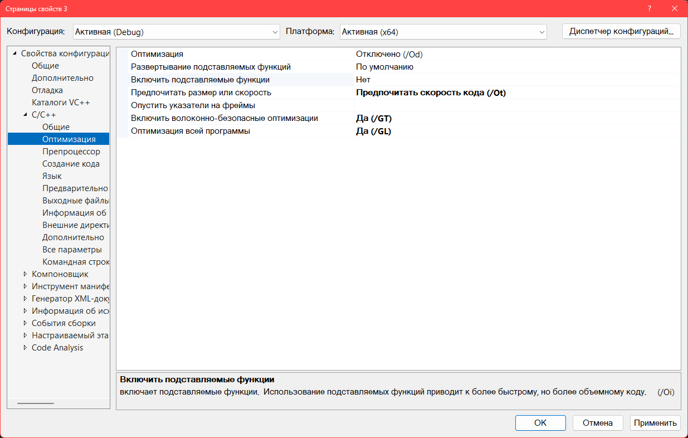
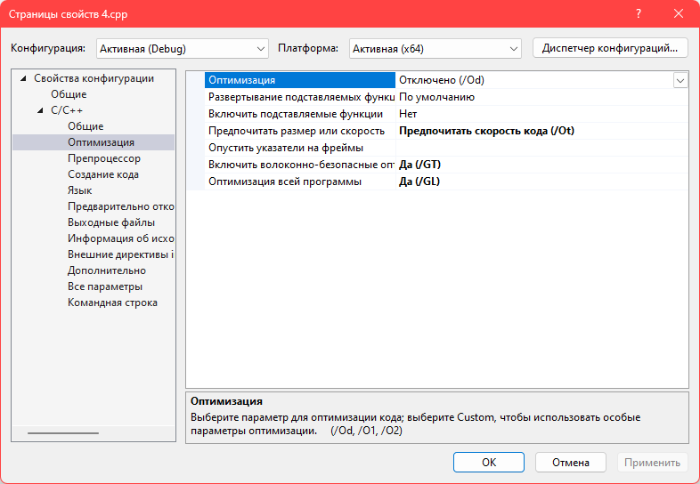

# Лекция 1. Техника работы

#### 1. В этом задании требуется научиться использовать компилятор C++ из командной строки или некоторого файлового менеджера.

- Напишите программу A + B на C++ в редакторе Far Manager. Можно использовать любой базовый текстовый редактор
- Выполните трансляцию программы из командной строки. Для упрощения работы можно использовать bat-файл
- Запустите программу из командной строки и проверьте ее работоспособность
- В отсчет вставьте текст программы и команды ее трансляции и запуска

```
Внимание. При проверке этого зания вам необходимо будет проедлать все эти действия в аудиториию При этом будет учитываться время выполнения задания. Задание будет засчитано, если время его выполнения не превысит две минуты
```

[testlib.h](https://github.com/MikeMirzayanov/testlib/blob/master/testlib.h)

### **Компилятор g++ флаги, оптимизация, сборка**

**Стандарты С++**

* ```-std=c++98``` - C++98
* ```-std=c++11``` - C++11
* ```-std=c++14``` - C++14
* ```-std=c++17``` - C++17
* ```-std=c++2a``` - C++20

**Предупреждения**

```-Wall``` - Выводит большинство предупреждений

```-Wfloat-equal``` - Предупреждает о не безопасном сравнении

```-Wsign-conversion``` или ```-Wsign-promo``` - Предупреждения преобразования signed в unsigned (и обратно)

```-Wold-style-cast``` - Выводит C Style преобразования типов

```-Warray-bounds``` - Доступ за пределы массива

```-Wdiv-by-zero``` - Предупреждать о делении на 0

```-Wdouble-promotion``` - Предупреждает о преобразовании с ```float``` на ```double```

```-Wbool-compire``` - Предупреждение о сравнении ```int``` с ```bool```


**Сборка**

Для сборки программы необходимо указать компилятору g++ файлы исходного кода, например команда g++ `main.cpp` скомпилирует исходный код файла `main.cpp` в исполняемый фаил `a.out` _(если компилятору не указать имя выходного файла то по умолчанию именем будет `a.out`)_

`-o <name>` - Имя выходного файла

**Пример:** Команда `g++ -o myexe` `main.cpp` скомпилирует фаил `main.cpp` в исполняемый фаил `myexe`.

Можно передавать несколько исходных файлов для сборки, например `g++ -o myexe` `file1.cpp file2.cpp`.

-c - Создание объектного файла

**Пример:** Для создания объектного файла необходимо указать компилятору ключи `-c и -o: g++ -c -o main.o` `main.cpp`, данной командой компилятор `g++` создает объектный фаил main.o из файла `main.cpp`

Для сборки программы из объектных файлов необходимо указать компилятору в качестве входных параметров не файлы исходного кода а объектные файлы: `g++ -o myexe` foo.o main.o bar.o - создает программу из объектных файлов foo.o main.o bar.o

-I<include_path> - Указание каталога для поиска подключаемых файлов

**Пример:** `g++ -o myexe` ` -I/my/path/to/include ``````main.cpp `

`-L<library_path>` - Указание каталога для поиска библиотек

`-l<library>` - Указание конкретной библиотеки для линковки

### **Компиляция программы на языке C++/CLI из командной строки**

[Пошаговое руководство. Компиляция программы на языке C из командной строки](https://learn.microsoft.com/ru-ru/cpp/build/walkthrough-compile-a-c-program-on-the-command-line?view=msvc-170)

[Предварительные требования](https://learn.microsoft.com/ru-ru/cpp/build/walkthrough-compiling-a-cpp-cli-program-on-the-command-line?view=msvc-170#prerequisites)

[Компиляция программы на C++/CLI](https://learn.microsoft.com/ru-ru/cpp/build/walkthrough-compiling-a-cpp-cli-program-on-the-command-line?view=msvc-170#compiling-a-ccli-program)

### **Программа суммы**

```cpp
#include <iostream>

int main()
{
    int a, b;
    std::cin >> a >> b;
    std::cout << a + b << '\n';
}
```

### **Команды для трансляции программы**
```txt
C:\Program Files\Microsoft Visual Studio\2022\Community>cd c:\
c:\ md c:\main
c:\ cd c:\main

c:\main>dir
Том в устройстве C имеет метку Eidos
 Серийный номер тома: 9C37-A8CD

 Содержимое папки c:\main

13.02.2023  14:34    <DIR>          .
13.02.2023  14:33               698 main.cpp
13.02.2023  14:46           246 784 main.exe
13.02.2023  14:46           151 526 main.obj
               3 файлов        399 008 байт
               1 папок  498 085 363 712 байт свободно

c:\main notepad main.cpp

c:\main>cl main.cpp
Оптимизирующий компилятор Microsoft (R) C/C++ версии 19.34.31937 для x86
(C) Корпорация Майкрософт (Microsoft Corporation).  Все права защищены.

main.cpp
C:\Program Files\Microsoft Visual Studio\2022\Community\VC\Tools\MSVC\14.34.31933\include\ostream(287): warning C4530: Использован обработчик исключений C++, но семантика уничтожения объектов не включена. Задайте параметр /EHsc
C:\Program Files\Microsoft Visual Studio\2022\Community\VC\Tools\MSVC\14.34.31933\include\ostream(272): note: во время компиляции функции-члена класс шаблон "std::basic_ostream<char,std::char_traits<char>> &std::basic_ostream<char,std::char_traits<char>>::operator <<(int)"
main.cpp(13): note: выполняется компиляция ссылки на экземпляр шаблон функции "std::basic_ostream<char,std::char_traits<char>> &std::basic_ostream<char,std::char_traits<char>>::operator <<(int)"
main.cpp(13): note: выполняется компиляция ссылки на экземпляр класс шаблон функции "std::basic_ostream<char,std::char_traits<char>>"
Microsoft (R) Incremental Linker Version 14.34.31937.0
Copyright (C) Microsoft Corporation.  All rights reserved.

/out:main.exe
main.obj

c:\main>main
15 7
22

c:\main>
```

#### 2. Для используемого вами транслятора подготовьте список основных опций трансляции. В него обязательно должны входить следующие опции: оптимизация кода, выбора стандарта языка, работы с предупреждениями и другие, которые покажутся вам важными. Сделайте краткое описание этих опций.

[Настройка компилятора и свойств сборки](https://learn.microsoft.com/ru-ru/cpp/build/working-with-project-properties?view=msvc-170)

[Использование набора инструментов Microsoft C++ из командной строки](https://learn.microsoft.com/ru-ru/cpp/build/building-on-the-command-line?view=msvc-170)




#### 3. Напишите программы с использованием особенностей С++11 и С++17. Выполните их трансляцию с указанием стандарта языка. Запустите эти программы и проверьте их работоспособность

Задание выполненно в среде Visual Studio Community 2022 17.4.5 
Среда разработки не включает стандарт С++11, поэтому, вместо него использовался стандарт С++14

```cpp

// Стандарт языка C++   Стандарт ISO C++14(std:c++14)

#include <iostream>
#include <algorithm>

int main()
{
    int a, b, c;
    std::cin >> a >> b >> c;
    std::cout << std::min({ a,b,c });
    return 0;
}
```

**Результат отладки**
```txt
9 1 5
1
```
//////////////////////////////////////////////////////////////////////////////////////////////////////////////////////////////////////////////////////////////
```cpp

// Стандарт языка C++   Стандарт ISO C++17(std:c++17)

#include <iostream>
#include <vector>

int main()
{
    int a, b, c;
    std::cin >> a >> b >> c;
    std::vector v = { a, b, c };
    for (auto x : v)
        std::cout << x << ' ';
    return 0;
}
```

**Результат отладки**
```txt
1 a Ж
1 0 -858993460
```


#### 4. В следующих заданиях потребуется сравнить время работы алгоритмов сортировки на С++ и других языках. Для этого потребуется приготовить тесты. Каждый тест будет последовательностью целых чисел. Каждый файл будет содержать несколько тестов

#### **Преднастройки трансляции**




#### **Листинг программы**
```cpp
#define _CRT_SECURE_NO_WARNINGS
#include <iostream>
#include <fstream>
#include <set>
#include <vector>
#include <string>

#include "testlib.h"

using namespace std;
int main(int argc, char *argv[]) {
    ios_base::sync_with_stdio(false);
    cin.tie(0); cout.tie(0);
    
    ifstream cin("param.txt");

    string fname, initstr;
    getline(cin, fname);
    getline(cin, initstr);
    registerGen(argc, argv, 1);
    setName(initstr.c_str());
    ofstream txt(fname);

    int groups, tests;
    cin >> groups >> tests;

    vector<int> len(groups);
    for (int& x : len)
        cin >> x;

    int from, to;
    cin >> from >> to;
    set <int> s;
    txt << groups << endl;
    for (int i = 0; i < groups; i++) {
        txt << tests << " " << len[i] << endl;
        for (int j = 0; j < tests; j++) {
            while (s.size() < len[i])
                s.insert(rnd.next(from, to));
            vector<int> shf(s.size());
            shf.assign(s.begin(), s.end());
            s.clear();
            shuffle(shf.begin(), shf.end());
            for (auto q : shf)
                txt << q << ' ';
            txt << '\n';
        }
    }
    return 0;
}
```

#### **param.txt**

Для данных параметров

```txt
output.txt
Kingdom of Cards
5
5 8 3
7 8 9
0 99
```

#### **output.txt**

Вывод следующий 

``txt
5
5 8
74 46 71 80 21 28 25 44 
17 7 1 99 86 31 29 10 
5 67 78 15 92 39 10 62 
61 93 77 56 85 96 67 34 
66 34 3 10 21 90 73 44 
5 3
85 55 7 
97 47 40 
25 93 44 
28 62 3 
35 50 1 
5 7
44 41 89 32 70 97 64 
38 94 11 2 96 48 64 
82 97 93 55 32 84 52 
55 94 69 89 18 36 63 
73 60 76 96 40 3 62 
5 8
37 15 29 22 32 8 10 75 
47 53 13 12 10 83 29 68 
15 53 48 82 90 72 87 83 
4 46 79 39 89 63 51 42 
68 42 34 10 86 87 40 83 
5 9
89 26 42 83 38 95 74 41 19 
56 54 67 37 27 32 39 52 16 
25 40 63 67 68 98 81 97 0 
3 43 70 94 10 9 56 5 22 
86 93 45 48 78 36 84 5 6 
``` 


#### 5. В этом задании вам надо будет написать программу для выполнения сотировки последовательности целых чисел в С++ разными способами. Их достаточно много. Выберем пять следующих способов.


```cpp
#define _CRT_SECURE_NO_WARNINGS
#include <iostream>
#include <fstream>
#include <set>
#include <vector>
#include <algorithm>
#include <chrono>

#define _CRT_SECURE_NO_WARNINGS
#include "testlib.h"

using namespace std;

double srt1(vector<int> v) {
    auto start = chrono::high_resolution_clock::now();
    sort(v.begin(), v.end());
    auto end = chrono::high_resolution_clock::now();
    chrono::duration<double>dur = end - start;
    return dur.count();

}
int main() {
    ios_base::sync_with_stdio(false);
    cin.tie(0);
    cout.tie(0);
    ifstream cin("tests.txt");
    int groups, tests;
    cin >> groups;
    vector <double> total(5);
    for (int i = 0; i < groups; i++) {
        int tests, len;
        cin >> tests >> len;
        for (int j = 0; j < tests; j++) {
            vector<int>v(len);
            for (int& x : v)
                cin >> x; // закончено чтение
            total[0] += min({srt1(v),srt1(v),srt1(v)});
            // str2
            // srt3
            // srt4
            // srt5

        }
    }
    return 0;
}
```


#### 6. Используя программы из предыдущих заданий, определите, вектор какой размера сортируется на вашем компьютере примерно за секунду. Для этого сделайте тестовый файл из одной группы тестов. В группе должно быть пять тестов некоторой длины _m_. Подберите это число так, чтобы среднее время работы саного быстрого метода сортивовки в файле protocol.txt равнялось примерной одной секунде. Будет достаточно, если число _m_ будет округлено до 100000, то есть число будет оканчиваться на 5 нулей. В отчете запишиет, какие длины тестов вы пробовали и какое время работы получили.

#### 7. Используя программы из предыдущих заданий и найденное ранее число _m_, создайте тестовый файл из 10 групп тестов. В каждой группе должно быть по три теста с длинами равными _0:2m, 0:4m, 0:6m, 0:8m, m, 1:2m, 1:4m, 1:6m, 1:8m, 2m_. Проверьте время сортировки на этих группах тестов. В отчет запишите данне из файла protocol.txt


#### 8.

#### 9.

#### 10.

#### 11.

#### 12.
